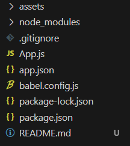
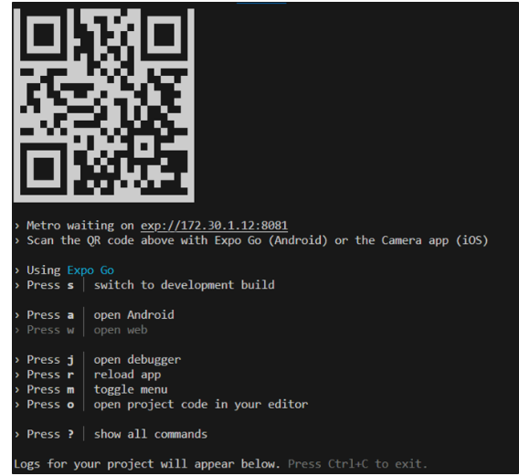

# React-native
> 이번 챕터는 app을 다운받아 구조만 파악한다.

## REACT Native란?

    react native는 Facebook에서 개발한 오픈 소스 프레임워크이다.  
    이 프레임워크는 자바스크립트와 REACT를 사용하여 IOS와 Android 앱을 개발하는데 사용된다.  
    react native는 2015년에 Facebook에서 공식적으로 발표하였으며 오픈소스 커뮤니티로 확장되어 사용되고 있다.    
    react native의 주요 장점은 자바와 같이 <mark>Learn once, write anywhere</mark>라는 철학을 따르고 있는 것이 주요 특징이다.
     
    react를 배우게 되면 ios, android, Web 개발을 한번에 하는 것이 가능하는 장점을 갖고 있으며 이를 통해 개발에 필요한 시간과 비용을 줄이는 것이 가능하여 초기 스타트업에서 빠른 속도로 애플리케이션을 개발하기 위해서 자주 사용한다.
     
    <h3>react native를 활용하여 만들어진 대표적인 APP</h3>
    <ol>
        <li>Facebook</li>
        <li>Instagram</li>
        <li>Skype</li>
        <li>Walmart</li>
    </ol>    

## Cross-platform 

    Cross-platform 개발이란 여러 운영 체제나 환경에서 작동하는 애플리케이션을 개발하는 방법을 의미하며 하나의 소스 코드를 작성하여 여러 플랫폼에서 실행할 수 있게 하는 것을 목표로 한다.
     
    예를 들어, Android와 Ios에서 작동하는 모바일 앱을 개발하는 경우, 각각 java/kotlin(안드로이드)와 Objective-C/Swift(ios)로 개발해야 한다. 이렇게 각 플랫폼에 맞게 개발하는 것을 <mark>네이티브 개발</mark>이라고 한다.  
    네이티브 개발을 하며 디바이스가 가지고 있는 <strong> 성능을 최대한 활용할 수 있다</strong>는 장점을 가지고 있으나 각 플랫폼별 개발을 해야하는 문제가 있어 개발 시간이 길어지고, 유지 보수가 어렵다는 단점이 있다.  
    이러한 문제를 해결하기 위해 <mark>크로스 플랫폼 개발</mark>이라는 개발 방법이 등장하였으며 이러한 크로스 플랫폼 개발 도구를 사용하여 한번에 여러 플랫폼에서 대응이 되는 애플리케이션 개발이 가능하게 되었다. 
     
    <h3>종류</h3>
    <ol>
        <li>react native (FaceBook)</li>
        <li>Flutter (Google)</li>
        <li>Xamarin (MS)</li>
        <li>Unity (Unity)</li>
    </ol>

## Reat Native 시작하기

    React Native를 개발하는 경우 크게 2가지 방식으로
    React-Native CLI로 개발하는 방법과 Expo Go 플랫폼을 이용하여 개발하는 방법이 존재한다.  
    그러나 React-Native Cli 기반의 경우 여러가지 설정 및 기본적인 구조를 직접 잡아가야 하는 문제가 있으며 기능 제공도 제한적인 편이기 때문에 우리는 Expo 기반으로 개발을 시작할 것이다. 

    expo 기반의 개발 시작하기
    npx create-expo-app AwesomeProject

<mark> 공식 문서</mark>  
[react-Native](https://reactnative.dev/)  
[expo](https://expo.dev/)

### Expo
Expo는 서드 파티에서 제공되는 서비스로 무료인 장점을 가지고 있으며 추가 비용을 지불하여 유료 서비스를 제공하고 있지만  ReactNative 앱을 구축하고 출시하기 위해서는 별도의 비용을 지불할 필요가 없다. 또한, 기본적으로 제공되는 몇 가지 도구를 사용하면 어느 정도 구조가 잡혀 있는 단계에서 개발을 시작할 수 있다는 장점이 있다.

이렇게 구조가 잡혀 있다는 말은, 순수한 네이티브의 기능과 함께 코드를 작성하기 좋은 형태로 프로젝트가 생성된다는 것을 의미하며 또한, Expo를 이용하여 빌드된 프로젝트를 언제든지 React Native CLI 형식으로 변환하는 것도 가능합니다.

### React Native CLI 
Expo가 존재하기 전, 커뮤니티가 제공한 도구로 기본적인 React Native 개발 설정을 제공해주었습니다. '기본'이라는 말은 추가적인 설정을 개발자가 직접 해야 한다는 단점을 내포하고 있습니다. 또한, 순수 네이티브의 기능을 이용하여 개발을 하는 경우, 작업이 번거로워진다는 단점도 있습니다. 하지만, 네이티브 코드(java, C, Swift, Kotlin)와의 통합은 비교적 쉽습니다. 따라서, 우리가 작성한 애플리케이션을 네이티브 코드와 합쳐야 한다면, React Native CLI를 이용하는 것이 좋은 선택이 될 수 있습니다.

### 환경 설치

    react-Native와 같은 Cross-flatform을 이용하면
    IOS의 경우 IOS 플랫폼에서만 실행이 가능하기 때문에 윈도우에서는 확인이 불가능하다.

#### 환경설정

1. node (12버전 이상)
2. Android 애뮬레이터

#### init 프로젝트 구조

1. assets : 이미지를 저장할 폴더이다.
2. node_modules : 해당 프로젝트를 실행하기 위해서 사용되는 서드 파트 패키지를 모아 놓은 곳이다.
3. package.json : 프로젝트에서 의존(Dependencies)하는 정보를 표시하는 공간이다.
4. babel-lock.json : 코드가 내부적으로 어떻게 변환되는지 설정하는 역할을 담당한다.
5. app.json : React Native 앱의 설정과 실행 방식을 구성하는 곳이다. 해당 파일은 스토어에 배포시 Expo와 함께 사용될 내용이다.
6. app.js : 본격적으로 프로그래밍을 하게될 파일이다.

#### 프로젝트 시작하기 

<code>$ npx expo start</code>  
<code> $ a  </code> // 안드로이드 실행을 의미한다.